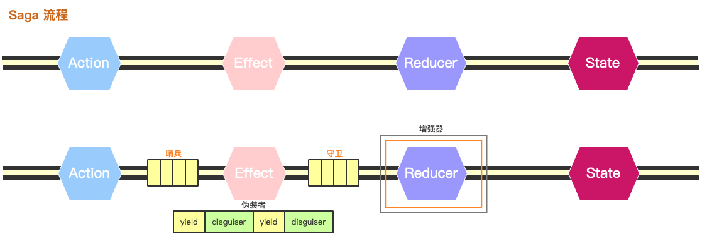

# dxjs

[](https://codecov.io/gh/taixw2/dx/)
[](https://npmjs.com/package/@dxjs/core)
[](https://github.com/taixw2/dxjs/workflows/Release/badge.svg)

基于 Redux、React-Redux、Redux-saga、Typescripe 的状态管理库

### Dxjs 能做什么

Dxjs 是一个 基于 redux-saga 和 typescript 的状态管理库，它在 redux-saga 的基础上新增了一些钩子，让你能够在数据流的任意阶段插入逻辑，

> 如果你对 redux-saga 和 typescript 不太熟悉，建议花一些时间先补一下课。 



### 基础特性

- **Symbol**, 解决 Action Type 冲突，通过方法名换取 Action, 免去定义烦恼
- **基于 Class**, 更多特性可用：私有属性、装饰器、继承
- **Typescript**: 减少类型错误，增强代码的鲁棒性
- **增强器**: 各个阶段植入逻辑，减少模板代码

### 安装

1. 你需要确保环境中支持 Reflect.metadata、Symbol, 建议引入 `reflect-metadata`
2. 引入最基础的三件套，`react`、`react-dom`、`react-redux`, 如果你采用的是 taro 等环境，则需要设置这三个的别名
3. 引入 dxjs 

```sh
1. npm install reflect-metadata es6-symbol # 也可以用其它库代替
2. npm install react react-dom react-redux # 如果采用的是 taro 或 react-native 则不用安装 react-dom 或者 react-redux，但是需要特殊处理, 见下方
3. npm install @dxjs/core @dxjs/common

# 采用 yarn
1. yarn add reflect-metadata es6-symbol
2. yarn add react react-dom react-redux
3. yarn add @dxjs/core @dxjs/common
```

### 在 taro 中安装依赖

```sh
# 代替上面第二部步
npm install @tarojs/redux @tarojs/redux-h5

# 在 config/index.js 中设置
alias: {
  "react": require.resolve("@tarojs/taro"),
  "react-dom": require.resolve("@tarojs/taro"),
  "react-redux": require.resolve("@tarojs/redux"),
}
```

### 快速开始

**创建一个 Dx 实例**

> 为了方便，create 会返回一个 React Component, 如果不想返回 Component, 可以使用 Dx.createStore
```typescript
import { Dx } from "@dxjs/core"

const DxApp = Dx.create({
    models: [],
    reducerEnhancer: [],
})
```

**创建 model**

> 只需要继承 DxModel, 你可以通过 Dx.collect 来收集 model, 或者手动传入到 Dx.create 中

```typescript
import { Dx, DxModel } from "@dxjs/core"

@Dx.collect()
class UserModel extends DxModel {}
```


**定义 reducer 和 effect**

> 利用装饰起 Effect 和 Reducer 来标识这是一个 effect 还是 reducer, 他们还接受一些参数
```typescript
import { Dx, DxModel } from "@dxjs/core"
import { Effect, Reducer } from "@dxjs/core"

@Dx.collect()
class UserModel extends DxModel {
    @Reducer()
    update(payload) {
        return { payload }
    }

    @Effect()
    update(payload) {
        this.$call(service)
    }
}
```

**获取Action**

通过 Dx.getModels 获取到所有的 model，注意获取到的都是构造函数，只是内部把所有的 effect 和 reducer 都挂在了静态方法上，所以看起来像直接调用了实例方法一样，实际上第二个参数设为 `true` 会直接调用 dispatch, 否则则会返回 action

```typescript
import { Dx } from "@dxjs/core"
Dx.getModels().UserModel.update("some", true)
Dx.getModels('UserModel').update("some", true)
Dx.getModels('Use').update("some", true)
Dx.getModels(/^Use/)[0].update("some", true)

```

**开始**

以上是一些基础功能，更多详细的介绍你需要更完整的查看文档：[文档入口](https://dxjs.fun)，接下来则开始准备使用吧。

### example

我还为大家准备了一些简单的 example:

- [sample \(by create-react-app\)](./examples/create-react-app)
- [sample2 \(by taro\)](./examples/taro-sample)

## 欢迎 Star、Pull Request、Issues、补充文档
